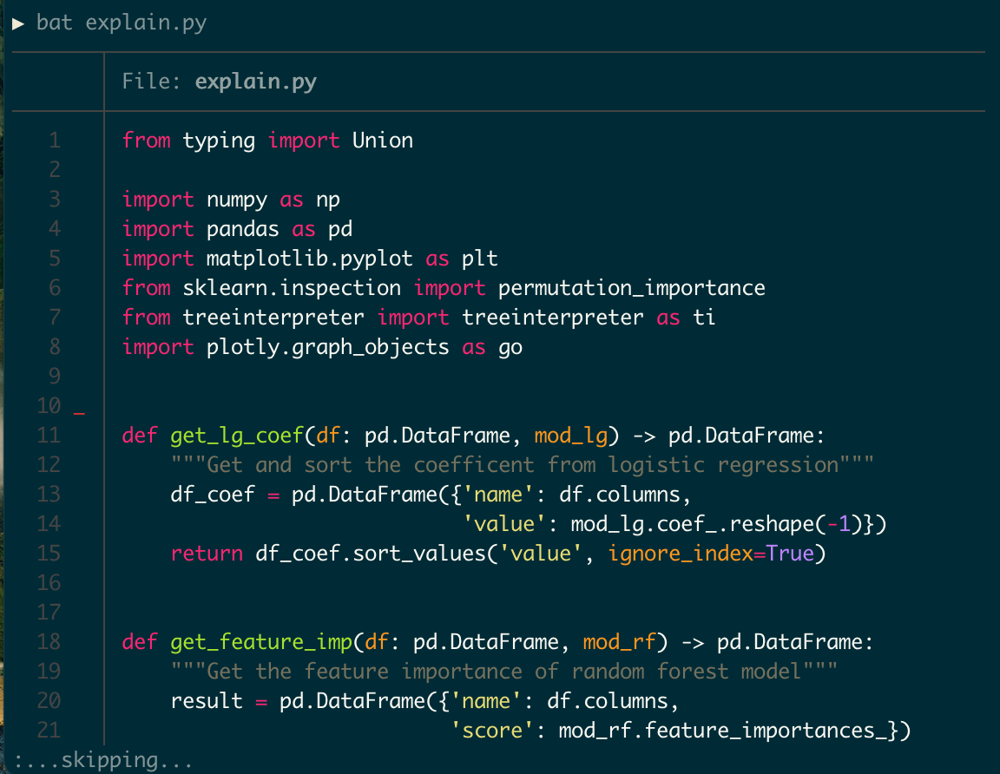
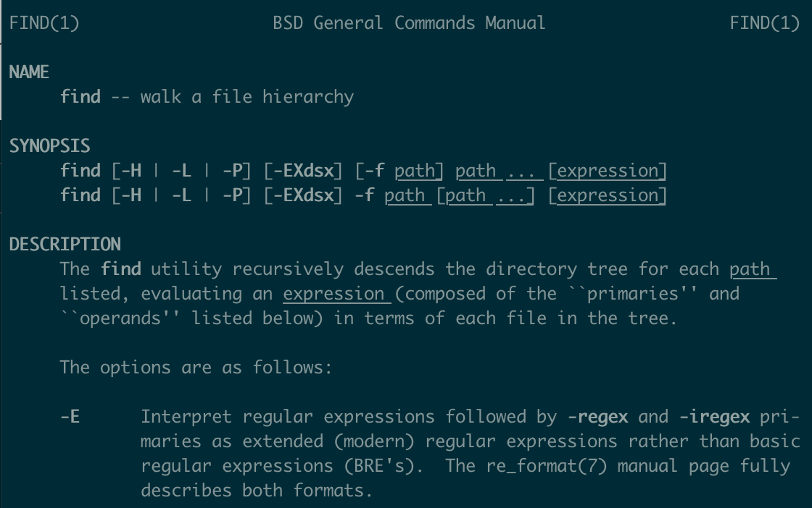
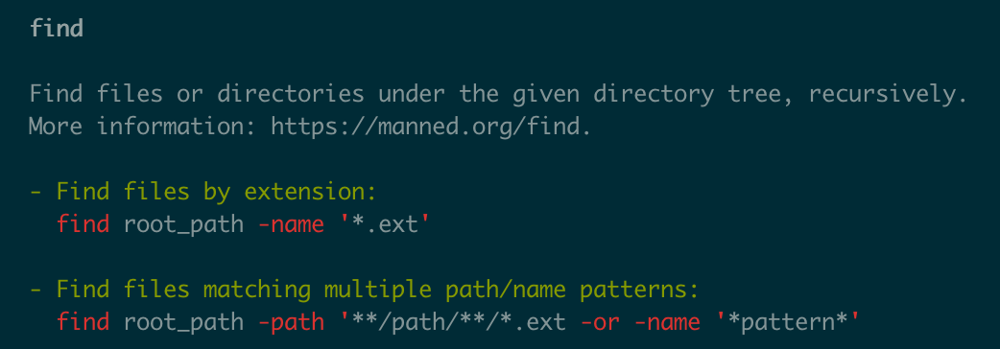

---
aliases:
- /2021/08/19/ds_cmd
date: '2021-08-19'
hide: false
layout: post
search_exclude: false
title: Notes from Data Science at the Command Line
toc: true

---

In this post, I want to write down some ideas from Jeroen Janssens's book [*Data Science at the Command Line, 2e*](https://www.datascienceatthecommandline.com/2e/index.html). Instead of being a comprehensive overview of the book, this note only picks some ideas that add to my existing knowledge and hopefully it can bring some new thoughts to you. Of course, this blog post reflects my personal understanding and all errors remain mine. 

## Introduction 

The original book can be divided into two parts. The first part covers how to use the command line to do four essential parts of data science: (1) obtaining data, (2) scrubbing data, (3) exploring data, (4) modeling data. The second part of the book introduces some useful command-line tools and methods for doing data science, including: (1) create command-line tools with shell script, Python and R; (2) use Makefile to do project and pipeline management; (3) implement parallel computing in the command line; (4) incorporate command line tools into other programming languages, including Python, R and Spark. 

However, to summarize my learning, I will break this blog post into four parts:

+ Useful tools: some command line packages and tools, including `Docker`, `Make`, and few other packages. 
+ Syntax tricks: some useful syntax that can be helpful for daily work. 
+ Integration with Python: how to combine the power of command line tools with Python. 
+ Useful Resources: some interesting resources for further learning.

## Useful Tools 

### Docker 

Docker in itself is a fascinating but complex topic and thus is beyond the scope of this blog and the original book. However, one idea I learn from the book is how the author uses Docker as an educational tool, which allows users to set up the same environment and follow the book easily. After [installing Docker](https://docs.docker.com/get-docker/), just running two lines of code in the command line will set up the prepared environment from the book.

```zsh
docker pull datasciencetoolbox/dsatcl2e
docker run --rm -it datasciencetoolbox/dsatcl2e
```

Another trick about Docker I learned is how the author uses the `-v` flag to get data in and out of container with a command like the following. (In macOS or Linux).

```zsh
docker run --rm -it -v "$(pwd)":/data datasciencetoolbox/dsatcl2e
```

The author recommended another book called *Docker: Up & Running* to learn more about Docker. You can also see this [A Docker Tutorial for Beginners](https://docker-curriculum.com/) to learn more about Docker. 

### Make

I was fortunate enough to learn and use [make](https://makefiletutorial.com/) in the past, which is one of the most valuable tools I learned in 2021. If you haven't learned, you should check out chapter 6 of [*Data Science at the Command Line, 2e*](https://www.datascienceatthecommandline.com/2e/index.html) to learn about it. `make` provides a nice way to build a data science pipeline and simplify complex commands. 

I will only highlight few tips I learn from chapter 6 here.

1. If the configuration file is not called `Makefile` (usually you shouldn't do this), you can run still run the file with a `-f` flag. For example, if you name the configuration file `hello.make`, I can run it with the following:

   ```zsh
   make -f hello.make
   ```

2. You can use the automatic variable `$@` to avoid some duplicates. For example, the following two commands will be equivalent. 

   ```makefile
   numbers:
   	seq 7 > $@
   	
   numbers:
    seq 7 > numbers
   ```

3. We can change the configuration of the make with the following codes in the top of the `Makefile`

   ```makefile
   SHELL := bash
   .SHELLFLAGS := -eu -o pipefail -c
   ```

   I will directly quote the author to explain this:

   >1. All rules are executed in a shell, which by default, is `sh`. With the *`SHELL`* variable we can change this to another shell, like `bash`. This way we can use everything that Bash has to offer such as for loops.
   >2. The *`.SHELLFLAGS`* line makes Bash more strict, which is considered a [best practice](http://redsymbol.net/articles/unofficial-bash-strict-mode/). For example, because of this, the pipeline in the rule for target *`top10`* now stops as soon as there is an error.

### Other tools 

There are two command line packages introduced in the book I particularly like: [bat](https://github.com/sharkdp/bat) and [tldr](https://tldr.sh/). Note that usually these two tools are not pre-installed and thus you need to install them with instructions from the link.

`bat` is an enhanced version of the common command-line tool `cat`. The following picture shows three benefits from `bat`:

+ It provides syntax highlighting.
+ It shows modification information from `git` (see the red line in line 10).
+ When showing a long file, instead of overwhelming the terminal with all the information like `cat`, it pipes the output to a pager like the `less` command. 

 

`tldr` aims to simplify the `man` command manual with concrete examples. Consider the following two manuals for the `find` command.





If you are not looking for some advanced and specific usages, the output page from `tldr` provides simpler and more useful instructions for understanding a command. 

## Syntax Trick

There are several useful syntaxes I learn from the book. 

1. The following command prints the variable in the variable `PATH` into separate lines, which can be helpful to debug issues around the environment path.

   ```zsh
   echo $PATH | tr ':' '\n'
   ```

2. [Shebang](https://en.wikipedia.org/wiki/Shebang_(Unix))
   + From the book: "The *shebang* is a special line in the script that instructs the system which executable it should use to interpret the commands."
   + You can see an example of *shebang* below. (`#!/usr/bin/env python` in the Python script).
   + The author recommends using commands like `!/usr/bin/env bash` instead of `!/usr/bin/bash` because this can avoid errors when executables are not in `/usr/bin`.

## Integration with Python 

Another useful thing I learned is to combine shell commands with Python. Specifically, there are two ways: (1) using shell command in Jupyter; (2) using Python to write shell scripts. 

### Shell Command in Jupyter

In a Python code shell of jupyter notebook or jupyter lab, we can call use shell commands by adding `!` before the command. For example, we can list the file in the current directory with 

```python
! ls
```

Or even assign the output of the command line to a Python variable. For example, we can do: 

```python
file_list = ! ls
```

This functionality allows us to utilize the brevity of shell commands to achieve things quickly. One example the author gives in the book is about downloading a file from the Internet. 

```python
url = "https://www.gutenberg.org/files/11/old/11.txt"

# Command line way (curly braces allow us to add python variable)
! curl '{url}' > alice3.txt

# Python way
import requests 

with open("alice2.txt", "wb") as f:
  response = requests.get(url)
  f.write(response.content)
```

 As we can see, the command line achieves the same thing with less code but still being easy to understand. 

Another syntax trick is that if you want to use literal curly braces for command line, you can type it twice in jupyter like the following: 



```python
! rm -v alice{{2,3}}.txt
```



### Use Python to Write Shell Scripts

We can create a shell script with Python and combine it into a command line pipeline. One example the author gives in the book is a script for the [Fizz Buzz problem](https://en.wikipedia.org/wiki/Fizz_buzz). The script is called `fizzbuzz.py`. 

```python
#!/usr/bin/env python
import sys

CYCLE_OF_15 = ["fizzbuzz", None, None, "fizz", None,
               "buzz", "fizz", None, None, "fizz",
               "buzz", None, "fizz", None, None]

## See the usage of type hint with :int and -> str
def fizz_buzz(n: int) -> str:
    ## In Python, (None or 1) = 1 ('buzz' or 5) = 'buzz'
    ## if the first element in or is evaluated as 
    ## None or False, it will go to the second element
    return CYCLE_OF_15[n % 15] or str(n)

if __name__ == "__main__":
    try:
        ## See the walrus operator := below
        ## which allows assign and evaluate at the same time
        while (n:= sys.stdin.readline()):
            print(fizz_buzz(int(n)))
    except:
        pass
```

With this script, you can combine it into a command line pipeline with the following command, which will show the result of Fizz Buzz problem for number from 1 to 30.

```zsh
seq 30 | ./fizzbuzz.py | column -x
```

Another thing I like is the way the author writes the Python code. In the simple script above, we can learn several Python techniques, including the [walrus operator](https://towardsdatascience.com/the-walrus-operator-7971cd339d7d) introduced in Python 3.8, type hint for functions, and the usage of `or`. I wrote my own comment with `##` in the command to annotate them. 

## Useful Resources

The first resource is definitely to read through the book [*Data Science at the Command Line, 2e*](https://www.datascienceatthecommandline.com/2e/index.html), which has a free online version. This blog only reflects my personal learning. Given everyone's unique background, you are likely to learn something different from the book. In addition to that, the author also recommends several resources inside the book which I find interesting:

+ *Thinking with Data*: this book seems to be a friendly introduction to how to approach real-world problems with a data-driven approach
+ [Explain Shell](https://explainshell.com/): a useful website that parses a command in the shell and explain the usage of each part
+ *Ten Essays on Fizz Buzz*: a book that discusses very aspects of Python and software design more general through 10 solutions for the Fizz Buzz problem 
+ *Pro Git*: a comprehensive guide to `git`
+ *Regular Expressions Cookbook*: a guide for regular expressions

I hadn't read any of the books above in detail but plan to do so and will try to share my notes for them once I finished. 

